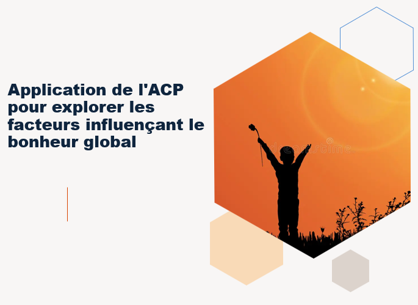

<p align="center">
  
</p>

# 🌍 Global Happiness Analytics - Exploring World Happiness Drivers

This project explores the key factors that influence global happiness levels using **Principal Component Analysis (PCA)**. By leveraging real-world data and dimensionality reduction techniques, we aim to uncover the most significant contributors to happiness across countries.

📅 **Duration:** November 2024 – January 2025  
---

## 📌 Objective

To apply PCA on global happiness data in order to:
- Reduce dimensionality and visualize country clusters
- Identify which socio-economic indicators contribute the most to overall happiness
- Support exploratory data analysis and insights on global well-being

---

## 📊 Dataset

- **Source:** [World Happiness Report](https://worldhappiness.report/)
- **Features include:**
  - GDP per capita
  - Social support
  - Healthy life expectancy
  - Freedom to make life choices
  - Generosity
  - Perceptions of corruption
  - Happiness score (used as a reference)

---

## 🧠 Methodology

1. **Data Preprocessing**
   - Handling missing values
   - Normalization and feature scaling

2. **Principal Component Analysis**
   - Applying PCA to reduce the feature space
   - Visualizing the explained variance
   - Projection of countries in 2D and 3D PCA space

3. **Insights & Interpretation**
   - Identifying principal components driving happiness
   - Clustering and interpretation of country groups

---

## 📈 Results

- PCA revealed that a small number of components (e.g. 2 or 3) can explain most of the variance in the dataset.
- The most influential features were **GDP**, **social support**, and **life expectancy**.
- Countries with similar socio-economic profiles formed identifiable clusters.

---

## 🛠️ Technologies

- Python
- Jupyter Notebook
- Pandas, NumPy, Scikit-learn
- Matplotlib, Seaborn
- Plotly (for interactive 3D visualizations)

---

## 🚀 How to Run

1. Clone the repo:

```bash
git clone https://github.com/Mohammed78-Dch/global-happiness-pca.git
cd global-happiness-pca
```

## 📬 Contact
For questions or suggestions:
Mohammed Dechraoui – mdechraoui@insea.ac.ma

